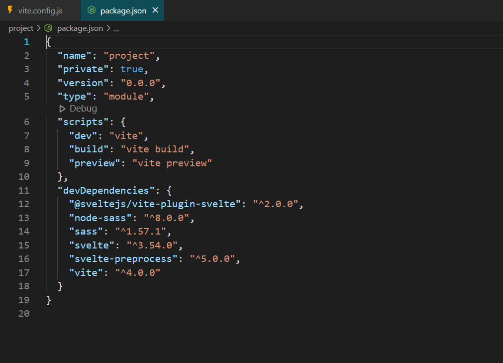

# Svelte-Js-with-Scss
Adding Scss to Svelte Js

## Installation

Install Svelte with vite

```bash
  npm create vite@latest
  
```
```bash
  Project name : project 
  Framework : SvelteJs
  Language : JavaScript
  
```
```bash
  cd project
  npm i
  npm install svelte-preprocess node-sass --save--dev
  npm i sass --save--dev
```

    
## Edti vite.config.js

```bash
    import { defineConfig } from 'vite'
    import { svelte } from '@sveltejs/vite-plugin-svelte'
    import { sveltePreprocess } from 'svelte-preprocess/dist/autoProcess'

    // https://vitejs.dev/config/
    export default defineConfig({
    plugins: [svelte({
        preprocess: sveltePreprocess()
    })],
    })

```

To deploy this project run

```bash
  npm run dev

  Project : http://localhost:5173
```


## Add Scss to App.svelte





