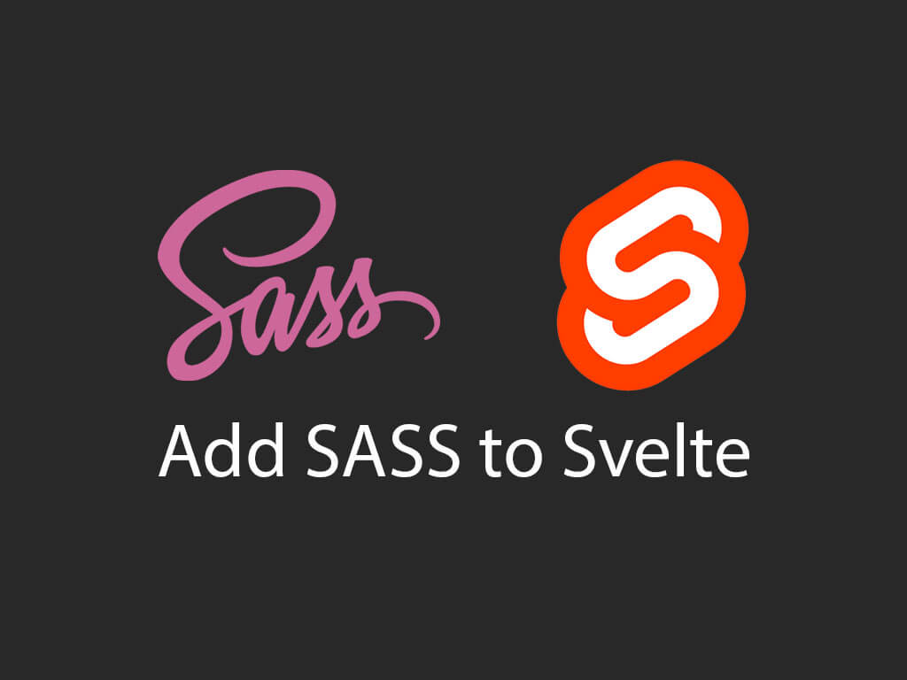
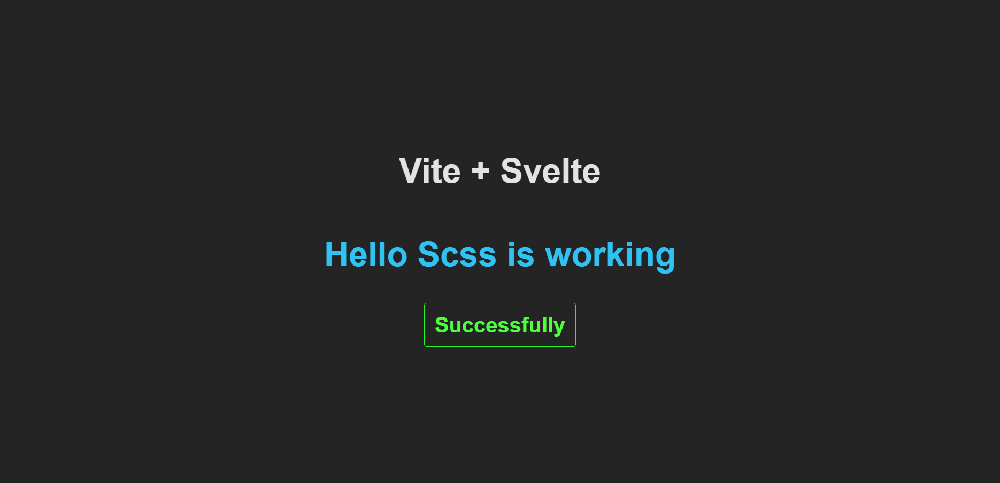

<div align="center">
    
</div>

Adding Scss to Svelte Js

## Installation

Install Svelte with vite

```bash
  npm create vite@latest
```

```bash
  Project name : project
  Framework : SvelteJs
  Language : JavaScript

```

```bash
  cd project
  npm i
```

```bash
  npm i svelte-preprocess node-sass --save--dev
  npm i sass --save--dev
```

## Edti vite.config.js

```bash
    import { defineConfig } from 'vite'
    import { svelte } from '@sveltejs/vite-plugin-svelte'
    import { sveltePreprocess } from 'svelte-preprocess/dist/autoProcess'

    // https://vitejs.dev/config/
    export default defineConfig({
    plugins: [svelte({
        preprocess: sveltePreprocess()
    })],
    })

```

Restart the <a>VS-Code</a> and Run the Command

```bash
  npm run dev
```

Project : [Localhost:5173](http://localhost:5173)

## package.json Code :


## Running on port : 5173



## Scss Code in App.svelte


